# PreferenceActivityCompat
[](./LICENSE)
[](https://github.com/ohmae/preference-activity-compat/releases)
[](https://github.com/ohmae/preference-activity-compat/issues)
[](https://github.com/ohmae/preference-activity-compat/issues?q=is%3Aissue+is%3Aclosed)
[](https://bintray.com/ohmae/maven/net.mm2d.preference)
[](https://bintray.com/ohmae/maven/net.mm2d.preference)

This is a compatibility library of `PreferenceActivity`.

This class can be used in much the same way as `PreferenceActivity`.
Moreover, the material design is applied, It is also possible to manage `PreferenceFragmentCompat` instead of `PreferenceFragment`.

## Background

As you know,
[`PreferenceFragmentCompat`](https://developer.android.com/reference/android/support/v7/preference/PreferenceFragmentCompat)
which is a compatibility class corresponding to [`PreferenceFragment`](https://developer.android.com/reference/android/preference/PreferenceFragment)
is provided in SupportLibrary.
([`com.android.support:preference-v7`](https://developer.android.com/topic/libraries/support-library/packages#v7-preference))
But compatibility class corresponding to [`PreferenceActivity`](https://developer.android.com/reference/android/preference/PreferenceActivity) is not provided.

When adding a new activity in AndroidStudio, `AppCompatPreferenceActivity` is created by selecting "Settings Activity" from the gallery.
Guessing from the name of "`AppCompatPreferenceActivity`", we will get an impression like the `PreferenceActivity` version of `AppCompatActivity`.
In the fact, it allows us to use some new APIs, but doesn't allows we to use material design theme in Android 4.x.

Also, since `AppCompatPreferenceActivity` can inflate only native Fragment, it can not inflate `PreferenceFragmentCompat` inheriting Fragment of support library.
There is also a Support Library version of [`PreferenceFragment`](https://developer.android.com/reference/android/support/v14/preference/PreferenceFragment)
that inherits the native Fragment.

But **the native Fragment is deprecated**.

## Screenshots

### Android 4.4 (Tablet)

|PreferenceActivityCompat:smile:|Native PreferenceActivity:scream:|
|-|-|
|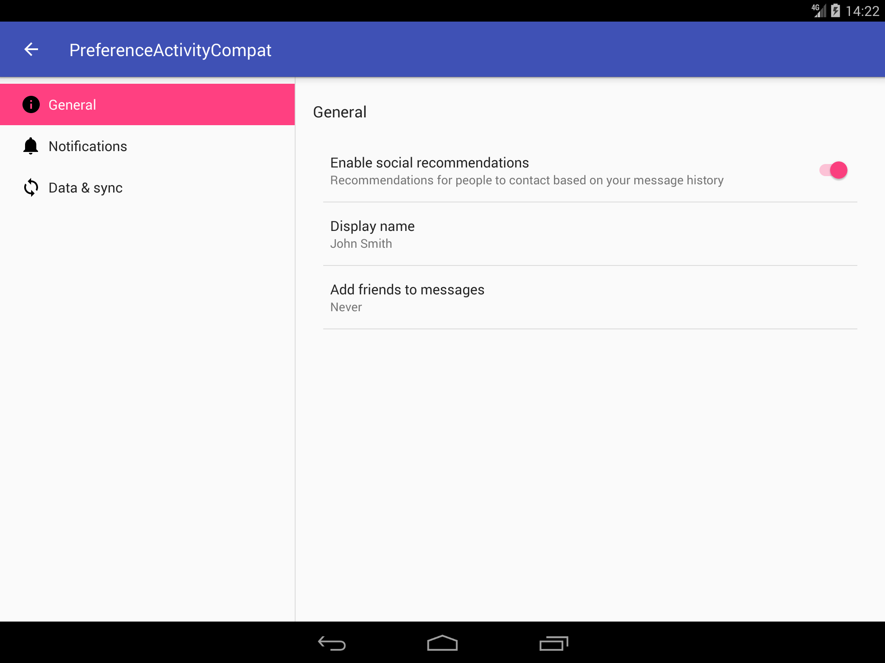|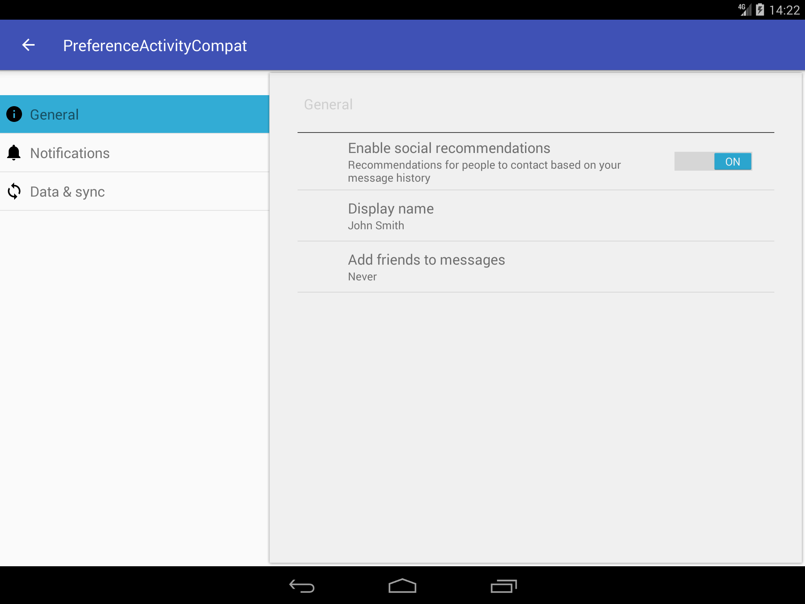|
|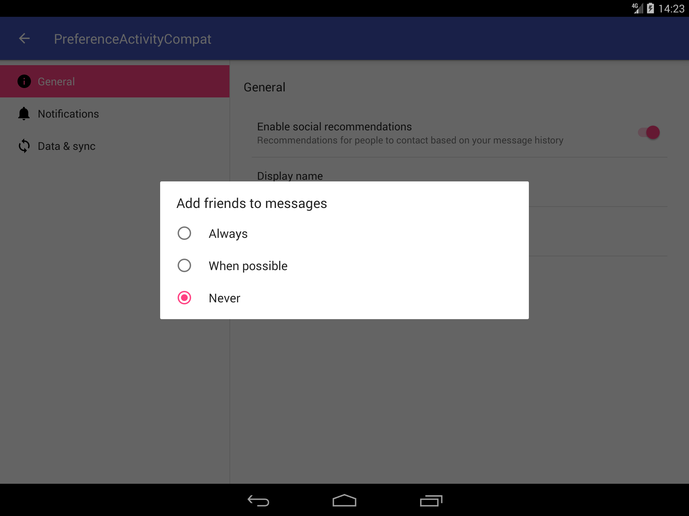|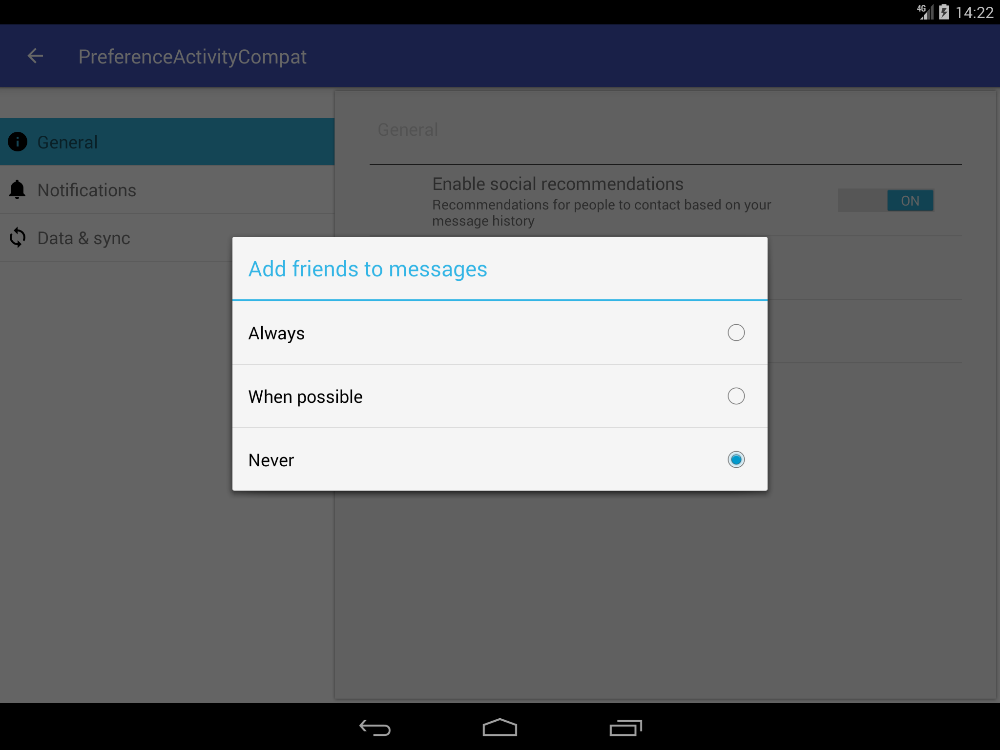|

### Android 7.1 (Tablet)

|PreferenceActivityCompat:smile:|Native PreferenceActivity:smile:|
|-|-|
|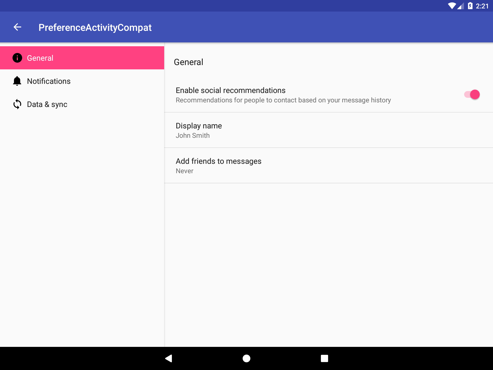||
||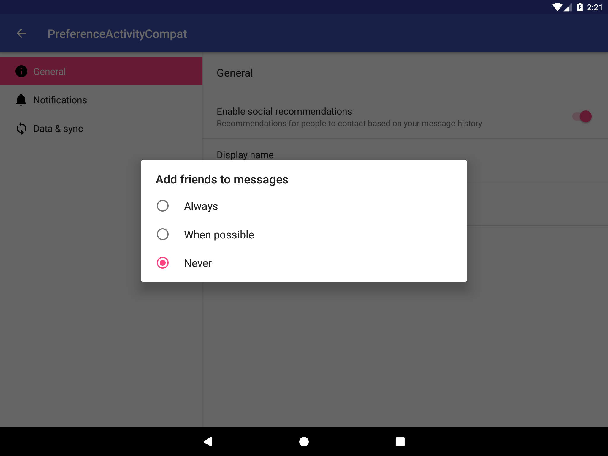|

### Android 4.4 (Phone)

#### PreferenceActivityCompat:smile:

|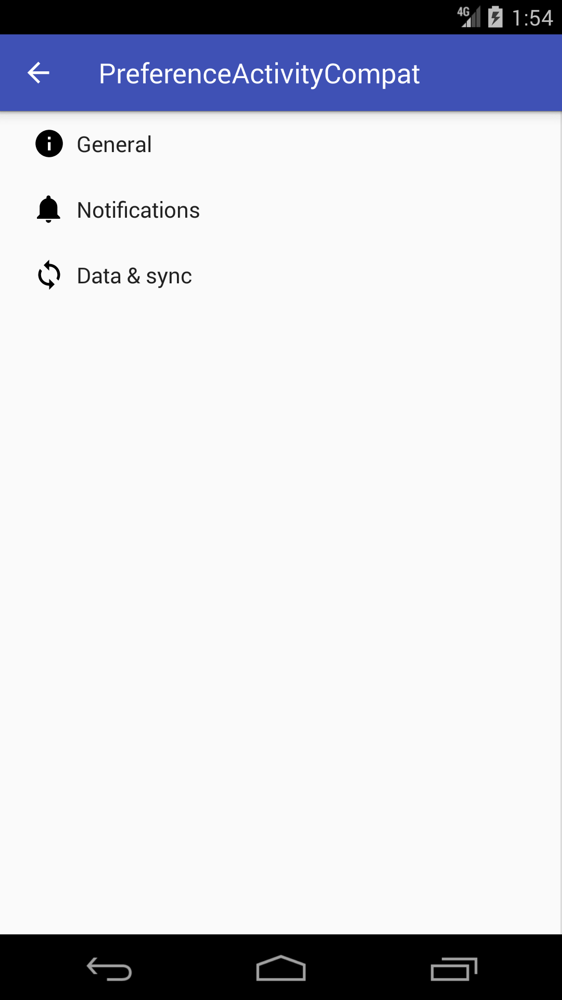|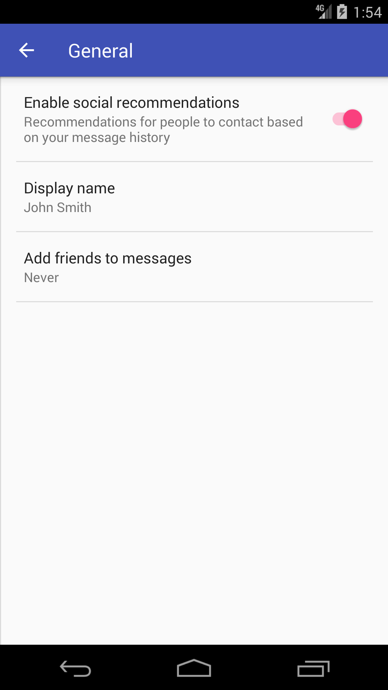|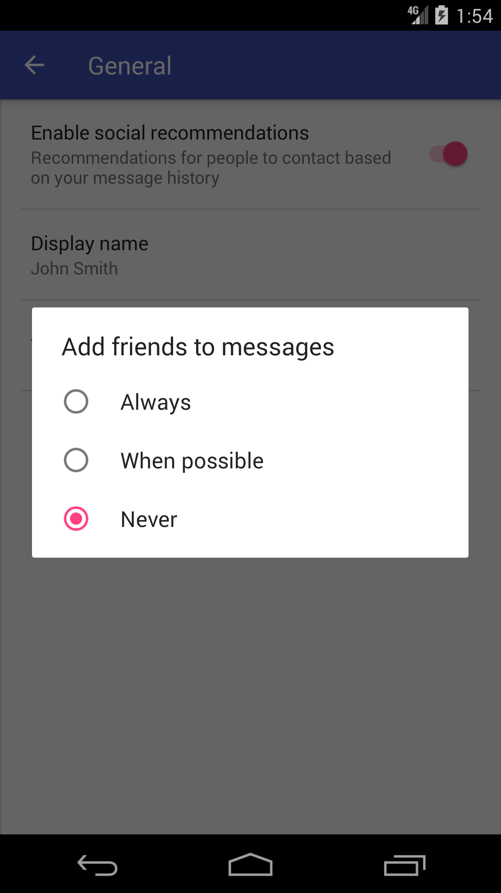|
|-|-|-|

#### Native PreferenceActivity:scream:

|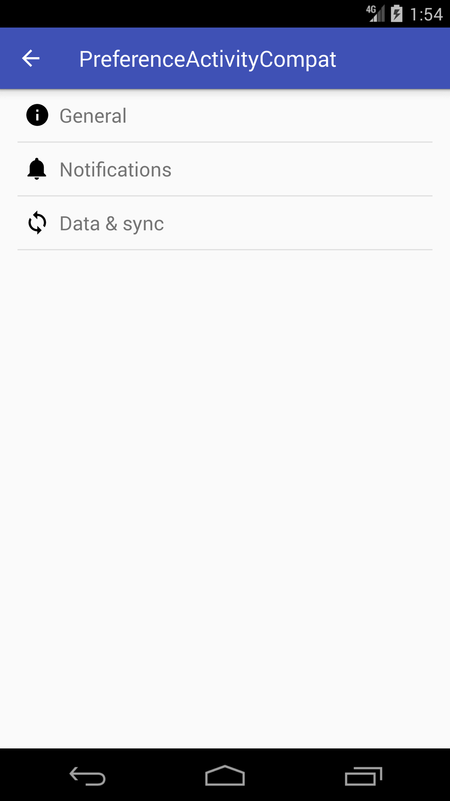|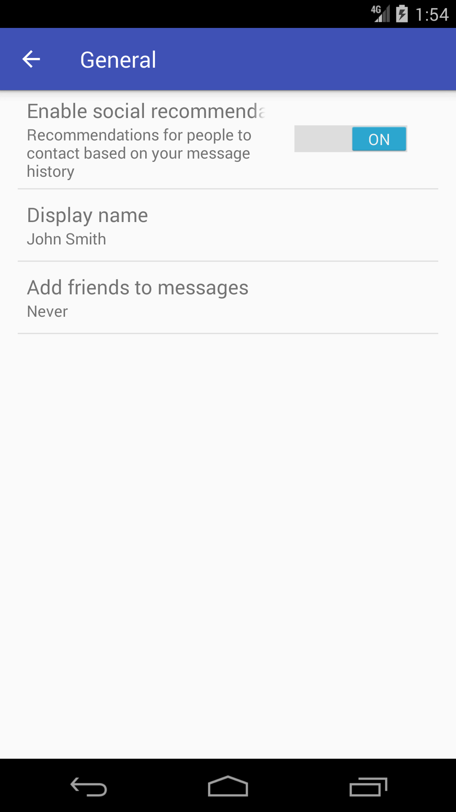|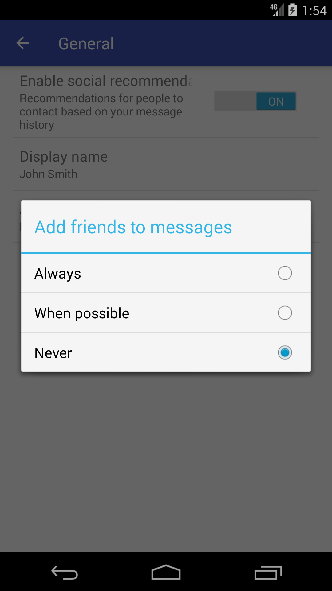|
|-|-|-|

### Android 7.1 (Phone)

#### PreferenceActivityCompat:smile:

||||
|-|-|-|

#### Native PreferenceActivity:smile:

|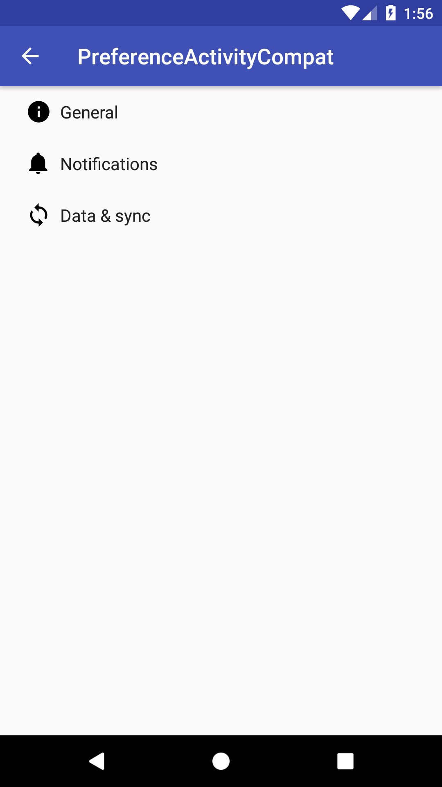|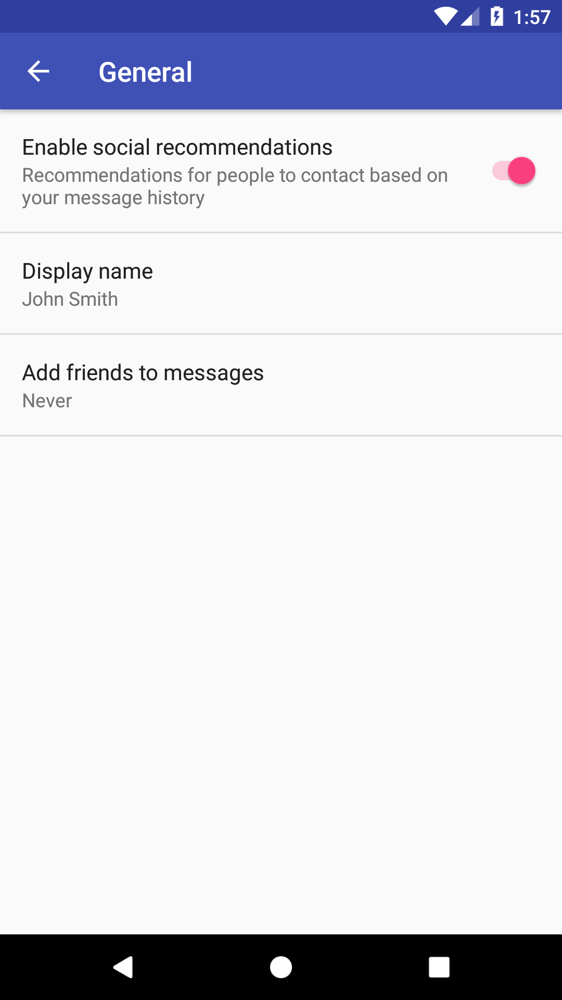|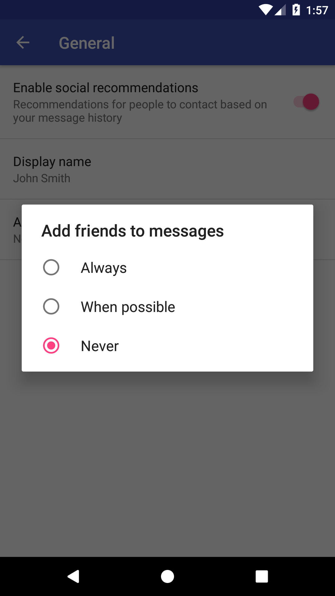|
|-|-|-|

## How to use

You can download this library from jCenter.
```gradle
repositories {
    jcenter()
}
```

Add dependencies, as following.
```gradle
dependencies {
    implementation 'net.mm2d:preference:0.1.0'
}
```

If you are using ProGuard, to load preference-header from xml, you might need to add the following option.
```
-keep public class * extends androidx.preference.PreferenceFragmentCompat
```

## Restriction

This class is only partially compatible with
[`PreferenceActivity`](https://developer.android.com/reference/android/preference/PreferenceActivity).
Only functions that are likely to be used are implemented.

e.g.
- The method to handle Preference is deprecated in Activity and is not implemented.
- [`FragmentBreadCrumbs`](https://developer.android.com/reference/android/app/FragmentBreadCrumbs) is not used.

This class can handle only `preference-headers`.

This class was created with the premise of using
[`PreferenceFragmentCompat`](https://developer.android.com/reference/androidx/preference/PreferenceFragmentCompat).
Therefore, it is not a restriction of this class itself, but it has the same restrictions as `PreferenceFragmentCompat`.

- We can't use `RingtonePreference`.
This is because `RingtonePreference` doesn't exist in the
[`androidx.preference`](https://developer.android.com/reference/androidx/preference/package-summary) package.
- `SwitchPreference` does not apply material design.
Because
[`androidx.preference.SwitchPreference`](https://developer.android.com/reference/androidx/preference/SwitchPreference)
is inflated.
If you want to apply material design, use
[`SwitchPreferenceCompat`](https://developer.android.com/reference/androidx/preference/SwitchPreferenceCompat)
instead.

Please see the next section.

## Migrate from AppCompatPreferenceActivity

1. Add `preferenceTheme` in `PreferenceActivity`'s theme. (important!)
```xml
    <style name="AppTheme" parent="Theme.AppCompat.Light.DarkActionBar">
        <item name="colorPrimary">@color/colorPrimary</item>
        <item name="colorPrimaryDark">@color/colorPrimaryDark</item>
        <item name="colorAccent">@color/colorAccent</item>

+        <item name="preferenceTheme">@style/PreferenceCompatTheme</item>
    </style>
```

2. Replace `SettingsActivity`'s super class
```java
- public class SettingsActivity extends AppCompatPreferenceActivity {
+ public class SettingsActivity extends PreferenceActivityCompat {
```
At that time, change the `isValidFragment` from `protected` to `public`.
```java
    @Override
-     protected boolean isValidFragment(final String fragmentName) {
+     public boolean isValidFragment(final String fragmentName) {
```

3. Change the parent of Fragment corresponding to each `PreferenceScreen` from `PreferenceFragment` to `PreferenceFragmentCompat`.
And implement `onCreatePreferences` instead of `onCreate`
```java
-     public static class GeneralPreferenceFragment extends PreferenceFragment {
+     public static class GeneralPreferenceFragment extends PreferenceFragmentCompat {
        @Override
-         public void onCreate(final Bundle savedInstanceState) {
-             super.onCreate(savedInstanceState);
+         public void onCreatePreferences(final Bundle savedInstanceState,final String rootKey) {
            addPreferencesFromResource(R.xml.native_pref_general);
        }
```

4. Change package import.
Use `net.mm2d.preference.Header` instead of `android.preference.PreferenceActivity.Header`
```java
- import android.preference.PreferenceActivity.Header;
+ import net.mm2d.preference.Header;
```
Use `androidx.preference` instead of `android.preference`
```java
- import android.preference.ListPreference;
- import android.preference.Preference;
- import android.preference.Preference.OnPreferenceChangeListener;
- import android.preference.PreferenceFragment;
- import android.preference.PreferenceManager;
+ import androidx.preference.ListPreference;
+ import androidx.preference.Preference;
+ import androidx.preference.Preference.OnPreferenceChangeListener;
+ import androidx.preference.PreferenceFragmentCompat;
+ import androidx.preference.PreferenceManager;
```

5. Change namespace of attributes to `app` instead of `android` in xml of `preference-headers`.
```xml
<preference-headers
-     xmlns:android="http://schemas.android.com/apk/res/android">
+     xmlns:app="http://schemas.android.com/apk/res-auto">
    <header
-         android:fragment="net.mm2d.preference.sample.SettingsActivity$GeneralPreferenceFragment"
-         android:icon="@drawable/ic_info_black_24dp"
-         android:title="@string/pref_header_general"
+         app:fragment="net.mm2d.preference.sample.SettingsActivity$GeneralPreferenceFragment"
+         app:icon="@drawable/ic_info_black_24dp"
+         app:title="@string/pref_header_general"
        />
```

6. Change tag to `SwitchPreferenceCompat` instead of `SwtichPreference` in xml of`PreferenceScreen`, if you need.
```xml
<PreferenceScreen xmlns:android="http://schemas.android.com/apk/res/android">
-     <SwitchPreference
+     <!--suppress AndroidElementNotAllowed -->
+     <SwitchPreferenceCompat
        android:defaultValue="true"
        android:key="example_switch"
        android:summary="@string/pref_description_social_recommendations"
        android:title="@string/pref_title_social_recommendations"
        />
```

## Author
大前 良介 (OHMAE Ryosuke)
http://www.mm2d.net/

## License
[MIT License](./LICENSE)
